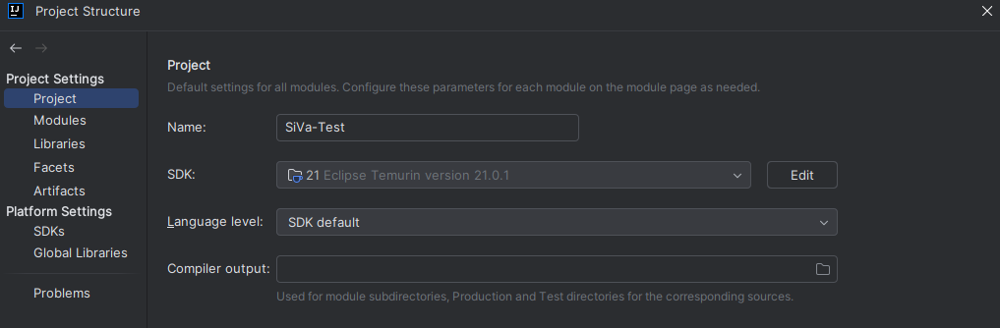
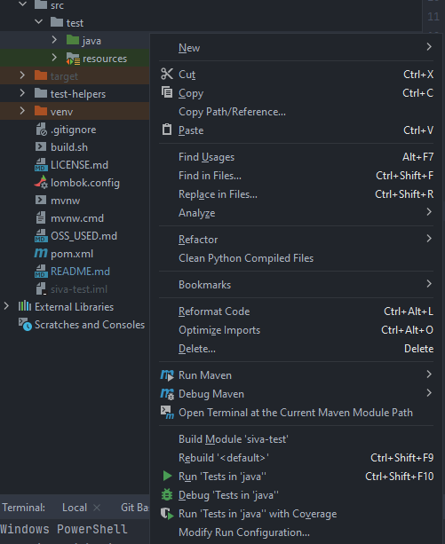

# Signature Verification Service Tests

Tests for Signature Verification Service.

## Prerequisites

- Java 11 JDK
- Maven
- [SiVa](https://github.com/open-eid/SiVa) must be deployed as accessible service.

## Execute tests and generate report

How to run tests in local environment.

### Using IntelliJ

#### Setup

- Open this project in IntelliJ (Community version will do) and press _'Load Maven project'_ when doing so for the first time.
- Open file -> Project Structure
- In the view:
    - Make sure -> SDK points to Java 11

  

#### Running tests

Open up src/test and right-click on the java folder, then press _Run 'Tests in 'java''_.

### Using Maven

- Make sure Java 11 JDK and Maven are installed. 
- Both PATH and JAVA_HOME are configured. Instructions for these can be found [here](https://www.baeldung.com/java-home-on-windows-7-8-10-mac-os-x-linux) and [here](https://www.tutorialspoint.com/maven/maven_environment_setup.htm).

### Report

- To generate a test report, Allure is required ([instructions for download](https://docs.qameta.io/allure/#_installing_a_commandline)).
- After running the tests, _allure-results_ folder is created under the project and the Allure report can be generated locally by the following command:
  - `allure serve`