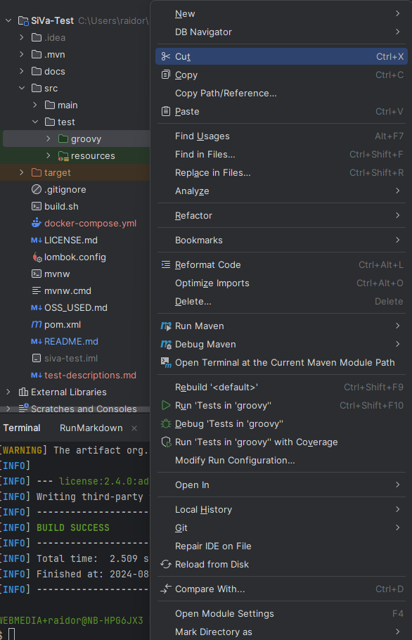

# Signature Verification Service Tests

Tests for Signature Verification Service.

## Prerequisites

- Java 21 JDK
- Maven
- [SiVa](https://github.com/open-eid/SiVa) must be deployed as accessible service.

## Configuring the tests

Create _application.properties_ based on [application.properties.sample](src/test/resources/application.properties.sample).
If needed, modify properties according to the
environment where SiVa is running at.

If you are running SiVa in local docker-compose setup as described at
https://github.com/open-eid/SiVa?tab=readme-ov-file#with-docker, then the default configuration should work.

**Descriptions of parameters in `application.properties`:**

| Parameter                     | Example               | Description                                                                   |
|:------------------------------|:----------------------|:------------------------------------------------------------------------------|
| siva.application-context-path | `/v3`                 | Custom service context.                                                       |
| siva.hostname                 | `localhost`           | Service URL.                                                                  |
| siva.port                     | `8080`                | Service port.                                                                 |
| siva.protocol                 | `http`                | Service protocol.                                                             |
| siva.request-size-limit       | `28311552`            | Service request body size limit.                                              |
| test-files-directory          | `src/test/resources/` | Test files directory path.                                                    |
| rest-assured-console-logging  | `true`                | Toggles printing Rest Assured logs in console.                                |
| allure-rest-request-limit     | `2000000`             | Sets limit for Allure rest request size to prevent report generation issues.  |
| allure-rest-response-limit    | `5000000`             | Sets limit for Allure rest response size to prevent report generation issues. |

## Execute tests and generate report

How to run tests in local environment.

### Using IntelliJ

#### Setup

- Open this project in IntelliJ (Community version will do) and press _'Load Maven project'_ when doing so for the first time.
- Open file -> Project Structure
- In the view:
    - Make sure -> SDK points to Java 21

  

#### Running tests

Open up src/test and right-click on the groovy folder, then press _Run 'Tests in 'groovy''_.

### Using Maven

- Make sure Java 21 JDK and Maven are installed. 
- Both PATH and JAVA_HOME are configured. Instructions for these can be found [here](https://www.baeldung.com/java-home-on-windows-7-8-10-mac-os-x-linux) and [here](https://www.tutorialspoint.com/maven/maven_environment_setup.htm).

### Report

- To generate a test report, Allure is required ([instructions for download](https://docs.qameta.io/allure/#_installing_a_commandline)).
- After running the tests, _allure-results_ folder is created under the _target_ directory and the Allure report can be generated locally by the following command:
  - `allure serve target/allure-results/`
